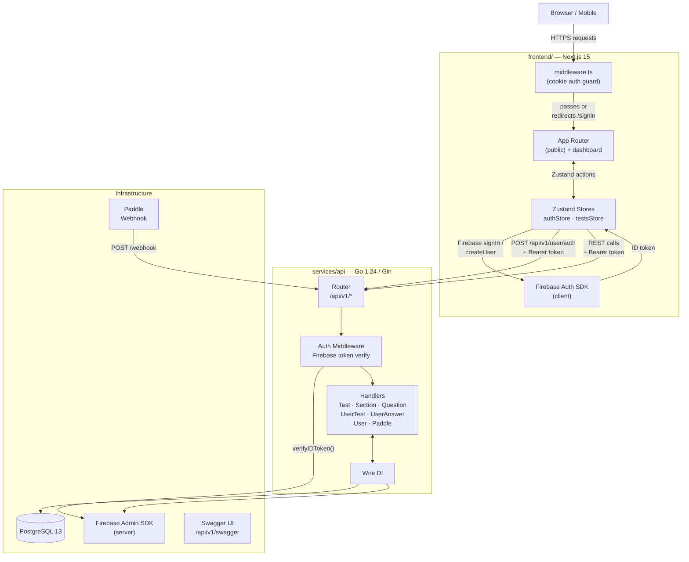
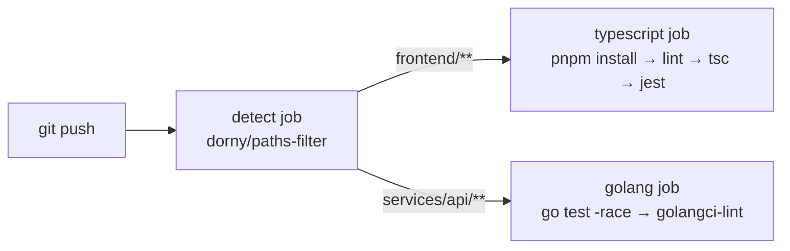

# MockExamLab

A polyglot monorepo for an IELTS mock-exam platform — Go REST API backed by PostgreSQL and Firebase Auth, Next.js 15 frontend with App Router.

---

## Architecture



---

## Repository Layout

```
mockexamlab/
├── services/
│   └── api/                  # Go 1.24 REST API
│       ├── internal/
│       │   ├── api/          # Gin handlers + router + wire
│       │   ├── cmd/          # Cobra CLI (runner, migrations)
│       │   ├── mapper/       # DTO ↔ model conversions
│       │   ├── models/       # GORM models + enums + DTOs
│       │   ├── repository/   # DB access layer
│       │   ├── service/      # Business logic
│       │   └── tools/        # env helpers
│       ├── docs/             # Swagger generated output
│       ├── docker-compose.yml
│       ├── DockerFile
│       └── go.mod
│
├── frontend/                 # Next.js 15 App Router
│   ├── app/
│   │   ├── (public)/         # Unauthenticated routes
│   │   │   ├── page.tsx      # Home landing
│   │   │   ├── signin/
│   │   │   └── signup/
│   │   ├── dashboard/        # Authenticated routes
│   │   │   ├── exams/
│   │   │   │   ├── page.tsx
│   │   │   │   └── exam/     # Active exam session
│   │   │   ├── profile/
│   │   │   ├── shop/
│   │   │   ├── social/
│   │   │   ├── stats/
│   │   │   ├── financial/
│   │   │   └── chat/
│   │   └── layout.tsx        # Root layout (global SCSS)
│   ├── components/           # Reusable UI components
│   ├── container/            # Page-level data containers
│   ├── store/                # Zustand stores
│   │   ├── authStore.ts
│   │   └── testsStore.ts
│   ├── lib/
│   │   └── firebase.ts       # Firebase app + Auth init
│   ├── middleware.ts          # Edge auth guard
│   └── styles/               # SCSS modules
│
├── Taskfile.yml              # Root orchestration
├── Taskfile.go.yml           # Go tasks (build / test / lint)
├── Taskfile.ts.yml           # TS tasks (dev / build / typecheck)
├── lefthook.yml              # Git hooks (fmt, lint, tidy)
├── pnpm-workspace.yaml
└── .github/workflows/ci.yml
```

---

## Quick Start

### Prerequisites

| Tool | Version |
|------|---------|
| Go | ≥ 1.24 |
| Node.js | ≥ 20 |
| pnpm | ≥ 9 |
| Task | ≥ 3 |
| Docker + Compose | any recent |

### Setup

```bash
# 1. Clone
git clone <repo-url> && cd mockexamlab

# 2. Install all deps + initialise go.work
task setup

# 3. Start the database
cd services/api && docker compose up -d app-db

# 4. Copy and fill env vars
cp services/api/.env.prod services/api/.env
# Edit DB_DSN, ADMIN_EMAIL, ADMIN_PASSWORD, Firebase credentials

# 5. Run the API (auto-migrates on start)
cd services/api && go run main.go serve

# 6. Run the frontend (separate terminal)
task ts:dev
```

### Useful Tasks

```bash
task doctor        # verify all tools present
task build:all     # build API + frontend
task test:all      # run all tests
task lint:all      # lint all code

task go:build      # GOWORK=off go build ./...
task go:test       # GOWORK=off go test ./... -race
task ts:dev        # pnpm --dir frontend dev
task ts:typecheck  # pnpm --dir frontend exec tsc --noEmit
```

---

## Environment Variables

### API (`services/api`)

| Variable | Required | Description |
|----------|----------|-------------|
| `DB_DSN` | yes | PostgreSQL DSN |
| `ADMIN_EMAIL` | no | Seeds admin Firebase user on start |
| `ADMIN_PASSWORD` | no | Seeds admin Firebase user on start |

### Frontend (`frontend/`)

Firebase config is embedded in `lib/firebase.ts`. No `.env` needed for local dev unless you override it.

---

## CI/CD

GitHub Actions (`.github/workflows/ci.yml`) runs two independent jobs using path filters:



---

## Contributing

- Go: `gofmt` enforced on pre-commit via lefthook; `go mod tidy` enforced on pre-push
- TypeScript: `next lint` on pre-commit; `tsc --noEmit` on pre-push
- Commits are not required to build both services — CI skips unchanged paths
