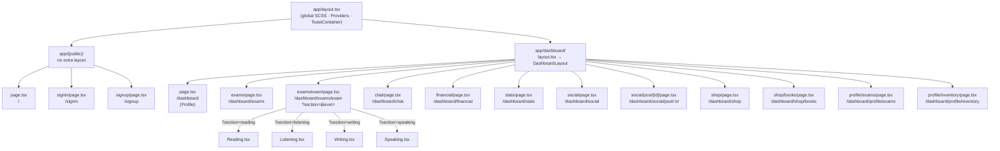
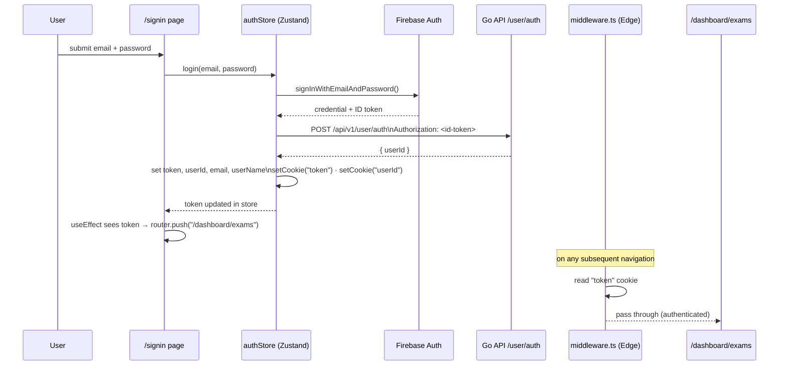
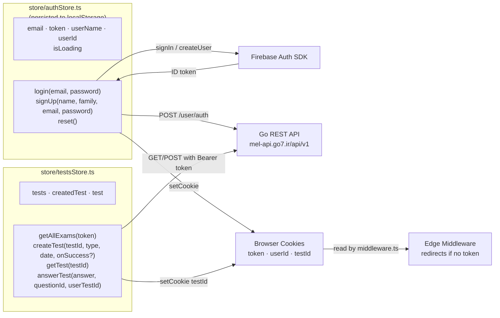
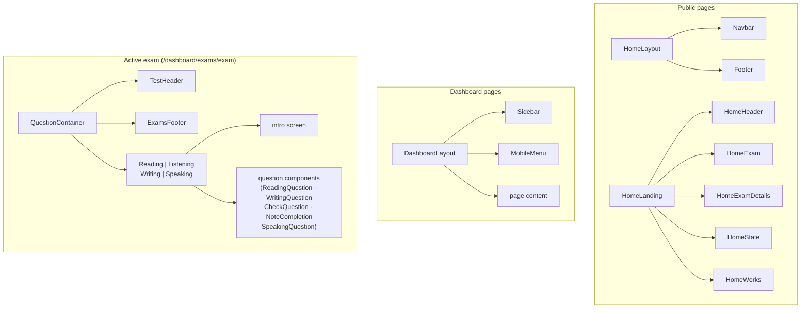
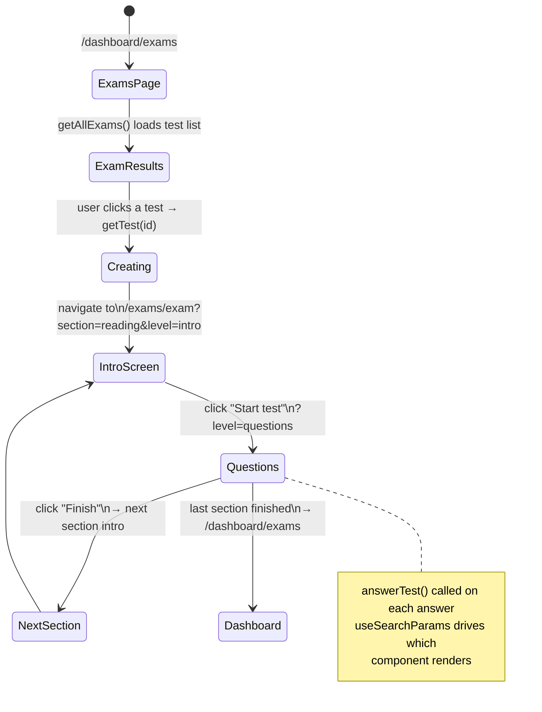

# MockExamLab Frontend

Next.js 15 App Router frontend for the MockExamLab platform. TypeScript, Zustand state management, Firebase Auth, and SCSS modules.

---

## Page Structure



---

## Auth Flow



---

## State Management

Two Zustand stores handle all application state. Both run entirely client-side.



### Store Persistence

`authStore` uses `zustand/middleware persist` — state survives page refresh via `localStorage` key `auth-storage`. `testsStore` is session-only (no persist middleware).

---

## Component Hierarchy



---

## Exam Session Flow



---

## Directory Reference

```
frontend/
├── app/
│   ├── layout.tsx              # Root layout — global SCSS, Providers
│   ├── (public)/               # Route group, no extra layout
│   │   ├── page.tsx            # Home landing
│   │   ├── signin/page.tsx     # Firebase sign-in form
│   │   └── signup/page.tsx     # Firebase sign-up form
│   └── dashboard/
│       ├── layout.tsx          # Empty (DashboardLayout lives in container)
│       ├── page.tsx            # Profile
│       ├── exams/
│       │   ├── page.tsx        # Exam list (calls getAllExams)
│       │   └── exam/page.tsx   # Active session (Suspense + useSearchParams)
│       ├── chat/page.tsx
│       ├── financial/page.tsx
│       ├── profile/
│       │   ├── exams/page.tsx
│       │   └── inventory/page.tsx
│       ├── shop/
│       │   ├── page.tsx
│       │   └── books/page.tsx
│       ├── social/
│       │   ├── page.tsx
│       │   └── post/[id]/page.tsx
│       └── stats/page.tsx
│
├── components/
│   ├── Providers.tsx           # 'use client' — ToastContainer
│   ├── ui/                     # Navbar, Footer, MobileMenu, Spinner ...
│   ├── dashboard/              # Sidebar, DashboardLayout, exam/profile/shop/social/stats
│   ├── exams/                  # Reading, Listening, Writing, Speaking + sub-components
│   └── home/                   # HomeHeader, HomeExam, HomeExamDetails ...
│
├── container/                  # Page-level containers (data fetching + layout wiring)
│   ├── ExamContainer.tsx
│   ├── HomeLanding.tsx
│   ├── QuessionContainer.tsx   # Suspense wrapper for useSearchParams
│   └── dashboard/
│       ├── ProfileContainer.tsx
│       ├── FinancialContainer.tsx
│       ├── ProfileInventoryContainer.tsx
│       ├── ShopContainer.tsx
│       ├── SocialContainer.tsx
│       └── StatsContainer.tsx
│
├── store/
│   ├── authStore.ts            # Auth state (persisted)
│   └── testsStore.ts           # Exam/test state
│
├── lib/
│   └── firebase.ts             # Firebase app + getAuth()
│
├── middleware.ts               # Edge middleware — reads "token" cookie
├── next.config.ts              # sassOptions only
└── styles/                     # SCSS modules per page/feature
```

---

## Running Locally

```bash
# from repo root
pnpm install          # installs all workspace deps
pnpm --dir frontend dev       # or: task ts:dev
```

App runs at `http://localhost:3000`.

### Available Scripts

```bash
pnpm --dir frontend dev          # dev server (Turbopack)
pnpm --dir frontend build        # production build
pnpm --dir frontend lint         # ESLint
pnpm --dir frontend exec tsc --noEmit   # type check
pnpm --dir frontend test         # Jest
```

---

## Edge Middleware

`middleware.ts` runs on every request before rendering. It reads the `token` cookie and redirects unauthenticated users to `/signin` for any non-public path.

```
Public paths:  /  /signin  /signup
Protected:     everything else (except _next/static, images, icons)
```

The matcher excludes static assets via a regex to avoid unnecessary edge invocations.
