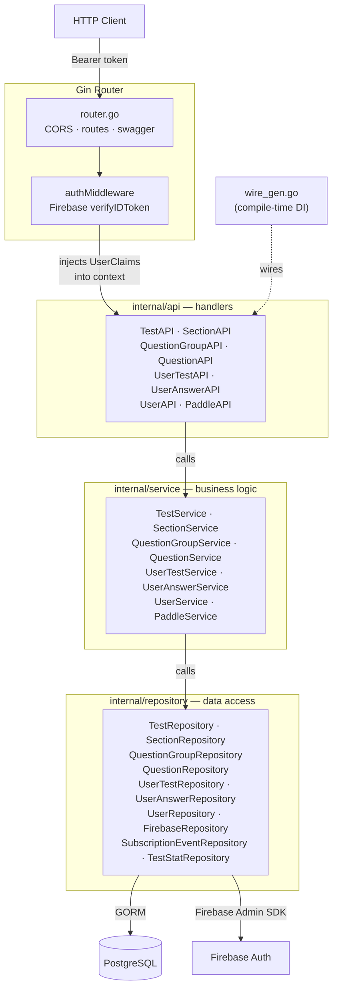
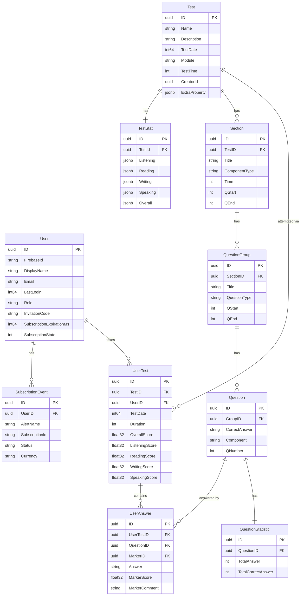
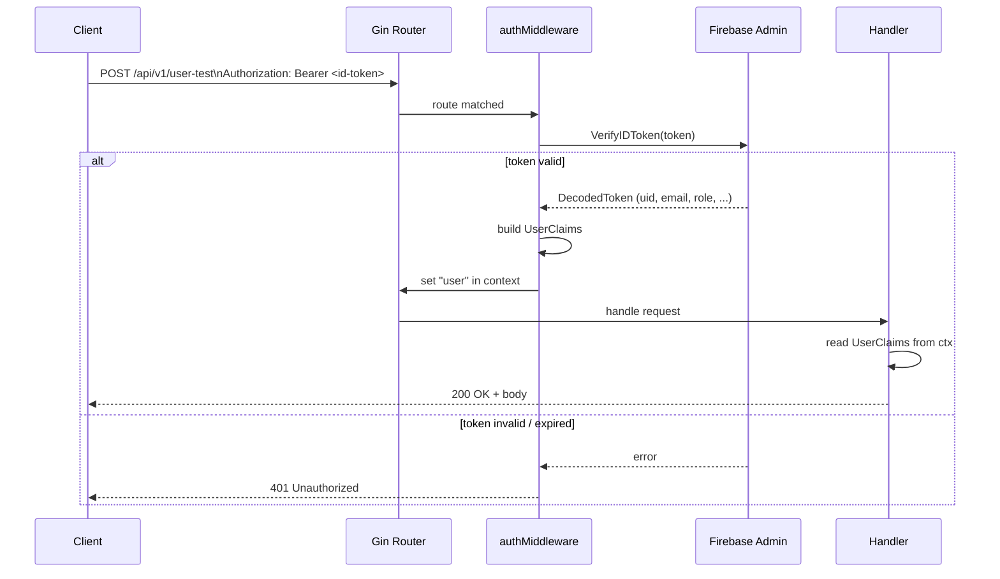
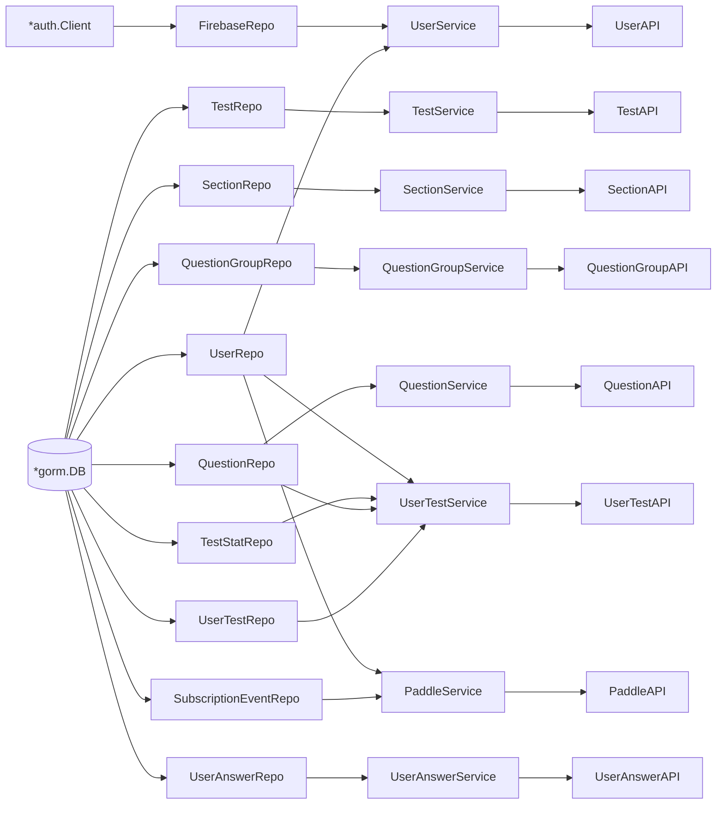

# MockExamLab API

Go 1.24 REST API for the MockExamLab platform. Built with Gin, GORM, Firebase Auth, and PostgreSQL.

---

## Layer Architecture



---

## Data Model



---

## Request Auth Flow



---

## API Routes

Base path: `/api/v1` — all routes except `/user/auth` and `/webhook` require a valid Firebase ID token.

### Tests

| Method | Path | Description |
|--------|------|-------------|
| `GET` | `/test/all` | List all tests |
| `GET` | `/test/:id` | Get test by ID |
| `GET` | `/test/full/:id` | Get test with all nested data (sections → groups → questions) |
| `POST` | `/test` | Create test |
| `PUT` | `/test` | Update test |
| `DELETE` | `/test/:id` | Delete test |

### Sections

| Method | Path | Description |
|--------|------|-------------|
| `GET` | `/section/all` | List all sections |
| `GET` | `/section/:id` | Get section by ID |
| `POST` | `/section` | Create section |
| `PUT` | `/section` | Update section |
| `DELETE` | `/section/:id` | Delete section |

### Question Groups

| Method | Path | Description |
|--------|------|-------------|
| `GET` | `/question-group/all` | List groups by section ID |
| `GET` | `/question-group/:id` | Get group by ID |
| `POST` | `/question-group` | Create group |
| `PUT` | `/question-group` | Update group |
| `DELETE` | `/question-group/:id` | Delete group |

### Questions

| Method | Path | Description |
|--------|------|-------------|
| `GET` | `/question/all` | List questions by group ID |
| `GET` | `/question/test/all` | List questions by test ID |
| `GET` | `/question/:id` | Get question by ID |
| `POST` | `/question` | Create question |
| `PUT` | `/question` | Update question |
| `DELETE` | `/question/:id` | Delete question |

### User Tests (Attempts)

| Method | Path | Description |
|--------|------|-------------|
| `GET` | `/user-test/all` | List user's test attempts |
| `GET` | `/user-test/:id` | Get attempt by ID |
| `POST` | `/user-test` | Start a new test attempt |
| `PUT` | `/user-test/submit` | Submit completed test |
| `DELETE` | `/user-test/:id` | Delete attempt |

### User Answers

| Method | Path | Description |
|--------|------|-------------|
| `GET` | `/user-answer/all` | List answers by user-test ID |
| `GET` | `/user-answer/:id` | Get answer by ID |
| `POST` | `/user-answer` | Submit single answer |
| `POST` | `/user-answer/speaking` | Submit speaking answer (audio) |
| `POST` | `/user-answer/batch` | Batch submit answers |
| `PUT` | `/user-answer/answer` | Update answer |
| `PUT` | `/user-answer/answer/speaking` | Update speaking answer |
| `PUT` | `/user-answer/marker` | Marker scores an answer |
| `DELETE` | `/user-answer/:id` | Delete answer |

### Users

| Method | Path | Description |
|--------|------|-------------|
| `POST` | `/user/auth` | Login or sign-up — no auth middleware |
| `GET` | `/user` | List users with filter + pagination |

### Public

| Method | Path | Description |
|--------|------|-------------|
| `POST` | `/webhook` | Paddle subscription webhook |
| `GET` | `/swagger/*any` | Swagger UI |

---

## Dependency Injection

Wire generates the full constructor chain at compile time (`wire_gen.go`). Each API group is wired independently — no global state.



---

## Running Locally

### Database only (Docker)

```bash
docker compose up -d app-db
```

### API directly

```bash
export DB_DSN="host=localhost user=postgres password=... dbname=MockExam port=5432 sslmode=disable"
export ADMIN_EMAIL="admin@example.com"   # optional — seeds admin user
export ADMIN_PASSWORD="secret"           # optional

go run main.go serve
# API on :8080
```

### Full stack (Docker Compose)

```bash
docker compose up
# copies vendor/ into container
```

---

## Swagger Docs

Available at `http://localhost:8080/api/v1/swagger/index.html`.

Regenerate after changing handler annotations:

```bash
# from services/api/
swag init -g main.go
```

---

## Conventions

- All primary keys are UUIDs generated in `BeforeCreate` GORM hooks
- Soft deletes via GORM `DeletedAt` on all models
- `CreatedAt` / `UpdatedAt` are Unix milliseconds (`int64`), not `time.Time`
- `ExtraProperty` and score arrays are stored as PostgreSQL `JSONB` via `jackc/pgtype`
- The auth middleware validates the raw Firebase ID token; the `Authorization` header value is the token itself
